---
## Front matter
title: "Отчёта по лабораторной работе"
subtitle: "Дисциплина: Архитектура ЭВМ"
author: "Перегудов Александр Вадимович"

## Generic otions
lang: ru-RU
toc-title: "Содержание"

## Bibliography
bibliography: bib/cite.bib
csl: pandoc/csl/gost-r-7-0-5-2008-numeric.csl

## Pdf output format
toc: true # Table of contents
toc-depth: 2
lof: true # List of figures
lot: true # List of tables
fontsize: 12pt
linestretch: 1.5
papersize: a4
documentclass: scrreprt
## I18n polyglossia
polyglossia-lang:
  name: russian
  options:
	- spelling=modern
	- babelshorthands=true
polyglossia-otherlangs:
  name: english
## I18n babel
babel-lang: russian
babel-otherlangs: english
## Fonts
mainfont: PT Serif
romanfont: PT Serif
sansfont: PT Sans
monofont: PT Mono
mainfontoptions: Ligatures=TeX
romanfontoptions: Ligatures=TeX
sansfontoptions: Ligatures=TeX,Scale=MatchLowercase
monofontoptions: Scale=MatchLowercase,Scale=0.9
## Biblatex
biblatex: true
biblio-style: "gost-numeric"
biblatexoptions:
  - parentracker=true
  - backend=biber
  - hyperref=auto
  - language=auto
  - autolang=other*
  - citestyle=gost-numeric
## Pandoc-crossref LaTeX customization
figureTitle: "Рис."
tableTitle: "Таблица"
listingTitle: "Листинг"
lofTitle: "Список иллюстраций"
lotTitle: "Список таблиц"
lolTitle: "Листинги"
## Misc options
indent: true
header-includes:
  - \usepackage{indentfirst}
  - \usepackage{float} # keep figures where there are in the text
  - \floatplacement{figure}{H} # keep figures where there are in the text
---

# Цель работы

Освоение процедуры компиляции и сборки программ, написанных на ассемблере NASM.

# Задание

Здесь приводится описание задания в соответствии с рекомендациями
методического пособия и выданным вариантом.

# Теоретическое введение

# Выполнение лабораторной работы

1. Создал каталог и перешёл в него. (рис. @fig:001)

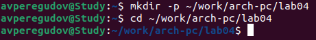{#fig:001 width=70%}

2. Создал файл hello.asm. (рис. @fig:002)

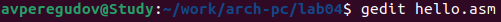{#fig:002 width=70%}

3. Запустил текстовый редактор gedit. (рис. @fig:003)

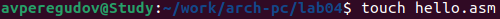{#fig:003 width=70%}

4. Ввёл текст исходного кода. (рис. @fig:004)

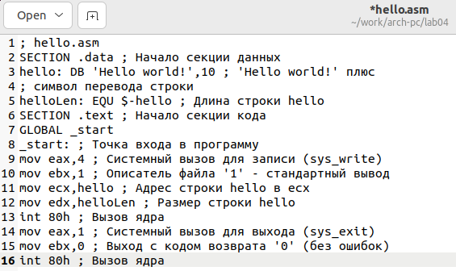{#fig:004 width=70%}

5. Скомпилировал текст программы. (рис. @fig:005)

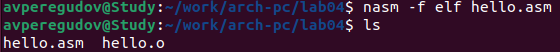{#fig:005 width=70%}

6. Провёл другую компиляцию с использованием большего количества параметров. (рис. @fig:006)

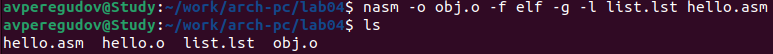{#fig:006 width=70%}

7. Передал объектный файл компоновщику. (рис. @fig:007)

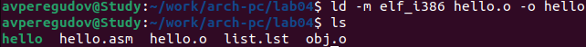{#fig:007 width=70%}

8. Создал исполняемый файл с определённым именем. (рис. @fig:008)

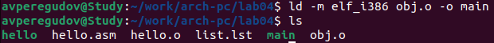{#fig:008 width=70%}

9. Запустил исполняемый файл. (рис. @fig:009)

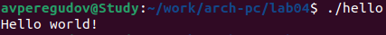{#fig:009 width=70%}

10. Создал копию файла hello.asm с именем lab4.asm. (рис. @fig:0010)

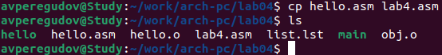{#fig:010 width=70%}

11. Открыл скопированный файл с помощью текстового редактора gedit. (рис. @fig:0011)

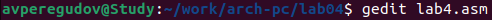{#fig:011 width=70%}

12. Внёс изменение в файл заменив Hello world! на фамилию и имя. (рис. @fig:0012)

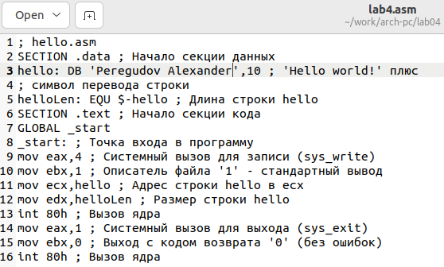{#fig:012 width=70%}

13. Оттранслировал текст программы в объектный файл и выполнил компоновку этого объектного файла. (рис. @fig:0013)

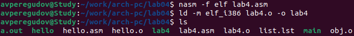{#fig:013 width=70%}

14. Запустил полученный исполняемый файл. (рис. @fig:0014)

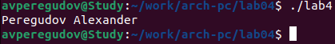{#fig:014 width=70%}

15. Скопировал файлы hello.asn и lab4.asm в локальный репозиторий. (рис. @fig:0015)

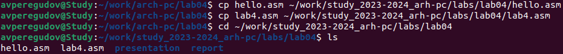{#fig:015 width=70%}

16. Сохранил изменения репозитория. (рис. @fig:0016)

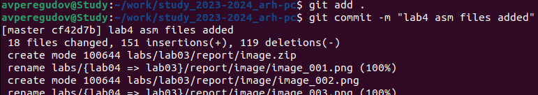{#fig:016 width=70%}

17. Загрузил файлы на GitHub. (рис. @fig:0017)

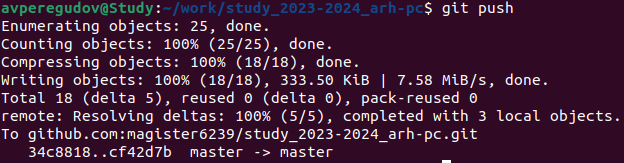{#fig:017 width=70%}

# Выводы

В данной лабораторной работе были усвоены процедуры компиляции и сборки программ, написанных на ассемблере NASM.

# Список литературы{.unnumbered}

::: {#refs}
:::
