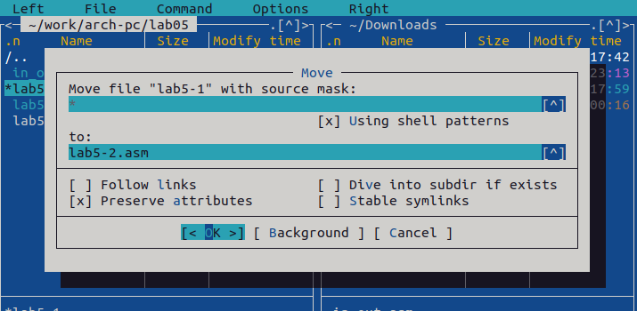
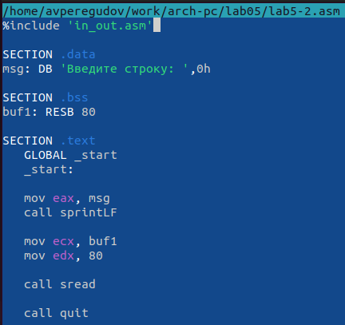

---
## Front matter
title: "Отчёта по лабораторной работе"
subtitle: "Дисциплина: Архитектура ЭВМ"
author: "Перегудов Александр Вадимович"

## Generic otions
lang: ru-RU
toc-title: "Содержание"

## Bibliography
bibliography: bib/cite.bib
csl: pandoc/csl/gost-r-7-0-5-2008-numeric.csl

## Pdf output format
toc: true # Table of contents
toc-depth: 2
lof: true # List of figures
lot: true # List of tables
fontsize: 12pt
linestretch: 1.5
papersize: a4
documentclass: scrreprt
## I18n polyglossia
polyglossia-lang:
  name: russian
  options:
	- spelling=modern
	- babelshorthands=true
polyglossia-otherlangs:
  name: english
## I18n babel
babel-lang: russian
babel-otherlangs: english
## Fonts
mainfont: PT Serif
romanfont: PT Serif
sansfont: PT Sans
monofont: PT Mono
mainfontoptions: Ligatures=TeX
romanfontoptions: Ligatures=TeX
sansfontoptions: Ligatures=TeX,Scale=MatchLowercase
monofontoptions: Scale=MatchLowercase,Scale=0.9
## Biblatex
biblatex: true
biblio-style: "gost-numeric"
biblatexoptions:
  - parentracker=true
  - backend=biber
  - hyperref=auto
  - language=auto
  - autolang=other*
  - citestyle=gost-numeric
## Pandoc-crossref LaTeX customization
figureTitle: "Рис."
tableTitle: "Таблица"
listingTitle: "Листинг"
lofTitle: "Список иллюстраций"
lotTitle: "Список таблиц"
lolTitle: "Листинги"
## Misc options
indent: true
header-includes:
  - \usepackage{indentfirst}
  - \usepackage{float} # keep figures where there are in the text
  - \floatplacement{figure}{H} # keep figures where there are in the text
---

# Цель работы

Приобретение практических навыков работы в Midnight Commander. Освоение инеструкций языка ассемблера mov и int

# Задание

Здесь приводится описание задания в соответствии с рекомендациями
методического пособия и выданным вариантом.

# Теоретическое введение

# Выполнение лабораторной работы

1. Открыл Midnight commander. (рис. @fig:001)

{#fig:001 width=70%}

2. Перешёл в каталог ~/work/arch-pc и создал. (рис. @fig:002). 

{#fig:002 width=70%}

3. Создал папку lab05. (рис. @fig:003).

{#fig:003 width=70%}

4. В папке lab5 создал файл lab5-1.asm. (рис. @fig:004).

{#fig:004 width=70%}

5. Открыл файл lab5-1.asm с помощью редактора mcedit и ввёл текст программы. (рис. @fig:005, @fig:006).

{#fig:005 width=70%}

{#fig:006 width=70%}

6. Сохранил и проверил содержимое файла lab5-1.asm.{@fig:007 width=70%}

{#fig:007 width=70%}

7. Оттранслировал текст программы в объектный файл а после выполнил компановку объектного{@fig:008 width=70%} файла.

{#fig:008 width=70%}

8. Запустил получившийся исполняемый файл и ввёл ФИО.{@fig:009 width=70%}

{#fig:09 width=70%}

9. Скачал файл in_out.asm с ТУИСа и скопировал его в каталог с программой.{рис. @fig:010, @fig:011, @fig:012}

{#fig:010 width=70%}

{#fig:011 width=70%}

{#fig:012 width=70%}

10. Создал копию файла lab5-1.asm и назвал копию lab5-2.asm.(рис. @fig:013, @fig:014).

{#fig:013 width=70%}

{#fig:014 width=70%} 

11. Заменил текст программы в lab5-2.asm с использованием подпрограмм из файла in_out.asm.{@fig:015 width=70%}

{#fig:015 width=70%}

12. Создал исполняемый файл на основе нового исходного кода и проверил его работу.{@fig:016 width=70%}

{#fig:016 width=70%}

13. Заменил текст программы в lab5-2.asm с использованием подпрограмм sprint вместо sprintLF.{@fig:017 width=70%}

{#fig:017 width=70%}

14. Создал исполняемый файл на основе нового исходного кода и проверил его работу.{@fig:018 width=70%}

{#fig:018 width=70%}

15. Создал копию файла lab5-1.asm.{@fig:019 width=70%}

{#fig:019 width=70%}

16. Изменил текст исходного кода в соответствии с новым алгоритмом.{@fig:020 width=70%}

{#fig:020 width=70%}

17. Получение исходного файла на основе нового исходного кода.{@fig:021 width=70%}

{#fig:021 width=70%}

18. Проверил новый исполняемый файл на работоспособность.{@fig:022 width=70%}

{#fig:022 width=70%}

19. Создал копию файла lab5-2.asm.{@fig:023 width=70%}

{#fig:023 width=70%}

20. Изменил текст исходного кода в соответствии с использованием процедур из файла in_out.asm.{@fig:024 width=70%}

{#fig:024 width=70%}

21. Получение исходного файла на основе нового исходного кода.{@fig:025 width=70%}

{#fig:025 width=70%}

22. Проверил новый исполняемый файл на работоспособность.{@fig:026 width=70%}

{#fig:026 width=70%}

# Выводы

В этой работе были приобретенный практические навыки работы в Midnight Commander, а также усвоенны инструкции языка ассемблера mov и int.

# Список литературы{.unnumbered}

::: {#refs}
:::
