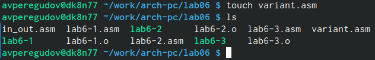

---
## Front matter
title: "Отчёта по лабораторной работе"
subtitle: "Дисциплина: Архитектура ЭВМ"
author: "Перегудов Александр Вадимович"

## Generic otions
lang: ru-RU
toc-title: "Содержание"

## Bibliography
bibliography: bib/cite.bib
csl: pandoc/csl/gost-r-7-0-5-2008-numeric.csl

## Pdf output format
toc: true # Table of contents
toc-depth: 2
lof: true # List of figures
lot: true # List of tables
fontsize: 12pt
linestretch: 1.5
papersize: a4
documentclass: scrreprt
## I18n polyglossia
polyglossia-lang:
  name: russian
  options:
	- spelling=modern
	- babelshorthands=true
polyglossia-otherlangs:
  name: english
## I18n babel
babel-lang: russian
babel-otherlangs: english
## Fonts
mainfont: PT Serif
romanfont: PT Serif
sansfont: PT Sans
monofont: PT Mono
mainfontoptions: Ligatures=TeX
romanfontoptions: Ligatures=TeX
sansfontoptions: Ligatures=TeX,Scale=MatchLowercase
monofontoptions: Scale=MatchLowercase,Scale=0.9
## Biblatex
biblatex: true
biblio-style: "gost-numeric"
biblatexoptions:
  - parentracker=true
  - backend=biber
  - hyperref=auto
  - language=auto
  - autolang=other*
  - citestyle=gost-numeric
## Pandoc-crossref LaTeX customization
figureTitle: "Рис."
tableTitle: "Таблица"
listingTitle: "Листинг"
lofTitle: "Список иллюстраций"
lotTitle: "Список таблиц"
lolTitle: "Листинги"
## Misc options
indent: true
header-includes:
  - \usepackage{indentfirst}
  - \usepackage{float} # keep figures where there are in the text
  - \floatplacement{figure}{H} # keep figures where there are in the text
---

# Цель работы

Освоение арифметических инструкций языка ассемблера NASM.

# Задание

Здесь приводится описание задания в соответствии с рекомендациями
методического пособия и выданным вариантом.

# Теоретическое введение

# Выполнение лабораторной работы

1. Создайте каталог для программ лабораторной работы № 6, перейшёл в него и 
создал файл lab6-1.asm. (рис. @fig:001)

{#fig:001 width=70%}

2. Использую gedit для редактирование файла lab6-1.asm (рис. @fig:002). 

{#fig:002 width=70%}

3. Ввел в файл lab6-1.asm текст программы из листинга 6.1 (рис. @fig:003).

{#fig:003 width=70%}

4. Создал исполняемый файл и запустил его. (рис. @fig:004)

{#fig:004 width=70%}

5. Изменил текст программы и вместо символов, записал в регистры числа. (рис. @fig:005)

. {#fig:005 width=70%}

6. Создал исполняемый файл и запустил его. {@fig:006 width=70%}

{#fig:006 width=70%}

7. Создал файл lab6-2.asm в каталоге ~/work/arch-pc/lab06 {@fig:007 width=70%}.

{#fig:007 width=70%}

8. Ввел в файл lab6-2.asm текст программы из листинга 6.2 {@fig:008 width=70%}.

{#fig:08 width=70%}

9. Создал исполняемый файл и запустил его.{рис. @fig:09}

{#fig:09 width=70%}

10. Изменил текст программы и вместо символов, записал в регистры числа.(рис. @fig:010).

{#fig:010 width=70%}

11. Создал исполняемый файл и запустил его.{@fig:011 width=70%}

{#fig:011 width=70%}

12. Замените функцию iprintLF на iprint.{@fig:012 width=70%}

{#fig:012 width=70%}

13. Создал исполняемый файл и запустил его.{@fig:013 width=70%}

{#fig:013 width=70%}

14. Создайте файл lab6-3.asm в каталоге ~/work/arch-pc/lab06.{@fig:014 width=70%}

{#fig:014 width=70%}

15. Ввел в файл lab6-3.asm текст программы из листинга 6.3.{@fig:015 width=70%}

{#fig:015 width=70%}

16. Создал исполняемый файл и запустил его.{@fig:016 width=70%}

{#fig:016 width=70%}

17. Изменил текст программы для вычисления результата другого выражения.{@fig:0-1 width=70%}

{#fig:0-1 width=70%}

18. Создал исполняемый файл и запустил его.{@fig:0-2 width=70%}

{#fig:0-2 width=70%}

19. Создал файл variant.asm в каталоге ~/work/arch-pc/lab06.{@fig:017 width=70%}

{#fig:017 width=70%}

20. Ввел в файл variant.asm текст программы из листинга 6.4.{@fig:018 width=70%}

{#fig:018 width=70%}

21. Создал исполняемый файл, запустил его и ввёл номер своего студенческого билета.{@fig:019 width=70%}

{#fig:019 width=70%}

22. Создал файл lab6-4.asm в каталоге ~/work/arch-pc/lab06.{@fig:1-1 width=70%}

{#fig:1-1 width=70%}

22. Ввёл код для вычисления значения функции от x из таблицы 6.3 под номером 20.{@fig:1-2 width=70%}

{#fig:1-2 width=70%}

23. Создал исполняемый файл.{@fig:1-3 width=70%}

{#fig:1-3 width=70%}

24. Запустил исполняемый файл и ввёл первое значение x.{@fig:1-4 width=70%}

{#fig:1-4 width=70%}

25. Запустил исполняемый файл и ввёл второе значение x.{@fig:1-5 width=70%}

{#fig:1-5 width=70%}

# Выводы

В этой работе были освоенны арифметические инструкции языка ассемблера NASM.

# Список литературы{.unnumbered}

::: {#refs}
:::
