---
## Front matter
title: "Отчёт по лабораторной работе"
subtitle: "Дисциплина: Архитектура ЭВМ"
author: "Перегудов Александр Вадимович"

## Generic otions
lang: ru-RU
toc-title: "Содержание"

## Bibliography
bibliography: bib/cite.bib
csl: pandoc/csl/gost-r-7-0-5-2008-numeric.csl

## Pdf output format
toc: true # Table of contents
toc-depth: 2
lof: true # List of figures
lot: true # List of tables
fontsize: 12pt
linestretch: 1.5
papersize: a4
documentclass: scrreprt
## I18n polyglossia
polyglossia-lang:
  name: russian
  options:
	- spelling=modern
	- babelshorthands=true
polyglossia-otherlangs:
  name: english
## I18n babel
babel-lang: russian
babel-otherlangs: english
## Fonts
mainfont: PT Serif
romanfont: PT Serif
sansfont: PT Sans
monofont: PT Mono
mainfontoptions: Ligatures=TeX
romanfontoptions: Ligatures=TeX
sansfontoptions: Ligatures=TeX,Scale=MatchLowercase
monofontoptions: Scale=MatchLowercase,Scale=0.9
## Biblatex
biblatex: true
biblio-style: "gost-numeric"
biblatexoptions:
  - parentracker=true
  - backend=biber
  - hyperref=auto
  - language=auto
  - autolang=other*
  - citestyle=gost-numeric
## Pandoc-crossref LaTeX customization
figureTitle: "Рис."
tableTitle: "Таблица"
listingTitle: "Листинг"
lofTitle: "Список иллюстраций"
lotTitle: "Список таблиц"
lolTitle: "Листинги"
## Misc options
indent: true
header-includes:
  - \usepackage{indentfirst}
  - \usepackage{float} # keep figures where there are in the text
  - \floatplacement{figure}{H} # keep figures where there are in the text
---

# Цель работы

Приобретение навыков написания программ с использованием подпрограмм.
Знакомство с методами отладки при помощи GDB и его основными возможностями.

# Задание

Здесь приводится описание задания в соответствии с рекомендациями
методического пособия и выданным вариантом.

# Теоретическое введение

Здесь описываются теоретические аспекты, связанные с выполнением работы.

Например, в табл. @tbl:std-dir приведено краткое описание стандартных каталогов Unix.

: Описание некоторых каталогов файловой системы GNU Linux {#tbl:std-dir}

| Имя каталога | Описание каталога                                                                                                          |
|--------------|----------------------------------------------------------------------------------------------------------------------------|
| `/`          | Корневая директория, содержащая всю файловую                                                                               |
| `/bin `      | Основные системные утилиты, необходимые как в однопользовательском режиме, так и при обычной работе всем пользователям     |
| `/etc`       | Общесистемные конфигурационные файлы и файлы конфигурации установленных программ                                           |
| `/home`      | Содержит домашние директории пользователей, которые, в свою очередь, содержат персональные настройки и данные пользователя |
| `/media`     | Точки монтирования для сменных носителей                                                                                   |
| `/root`      | Домашняя директория пользователя  `root`                                                                                   |
| `/tmp`       | Временные файлы                                                                                                            |
| `/usr`       | Вторичная иерархия для данных пользователя                                                                                 |

Более подробно об Unix см. в [@gnu-doc:bash;@newham:2005:bash;@zarrelli:2017:bash;@robbins:2013:bash;@tannenbaum:arch-pc:ru;@tannenbaum:modern-os:ru].

# Выполнение лабораторной работы

1. Создал каталог для выполнения лабораторной работы № 9, перешёл в него и создал файл lab09-1.asm (рис. @fig:001).

{#fig:001 width=70%}

2. Ввёл в файл lab09-1.asm текст программы из листинга 9.1 (рис. @fig:002).

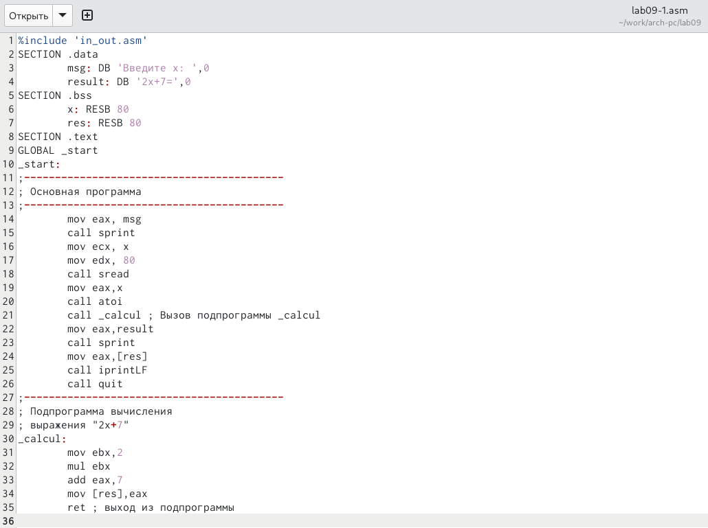{#fig:002 width=70%}

3. Создал исполняемый файл и проверил его работу (рис. @fig:003).

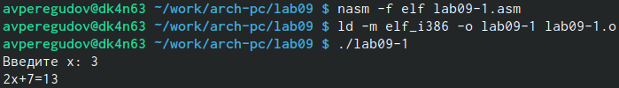{#fig:003 width=70%}

4. Изменил текст программы, добавив подпрограмму _subcalcul в подпрограмму _calcul, для вычисления выражения 𝑓(𝑔(𝑥)), где 𝑥 вводится с клавиатуры, 𝑓(𝑥) = 2𝑥 + 7, 𝑔(𝑥) = 3𝑥 − 1 (рис. @fig:004).

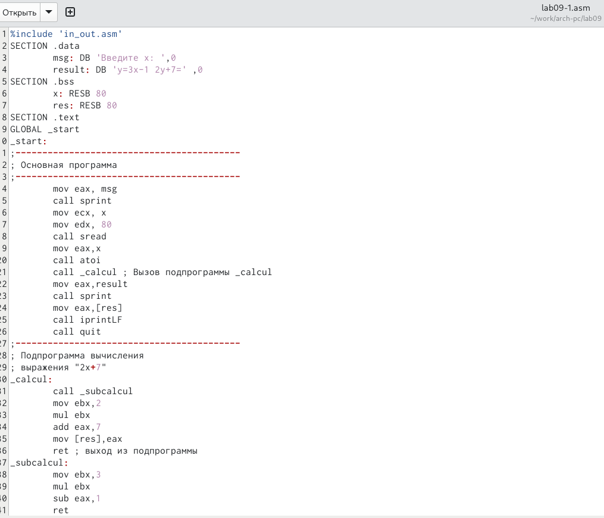{#fig:004 width=70%}

5. Создал исполняемый файл и проверил его работу (рис. @fig:005).

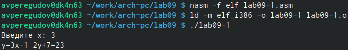{#fig:005 width=70%}

6. Создал файл lab09-2.asm (рис. @fig:006).

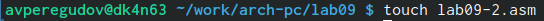{#fig:006 width=70%}

7. Ввёл в файл lab09-2.asm текст программы из листинга 9.2 (рис. @fig:007).

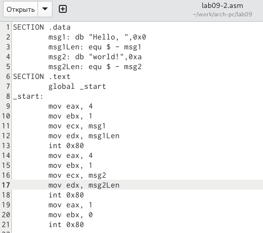{#fig:007 width=70%}

8. Создал исполняемый файл (рис. @fig:008).

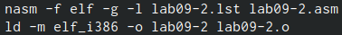{#fig:008 width=70%}

9. Загрузил исполняемый файл в отладчик gdb (рис. @fig:009).

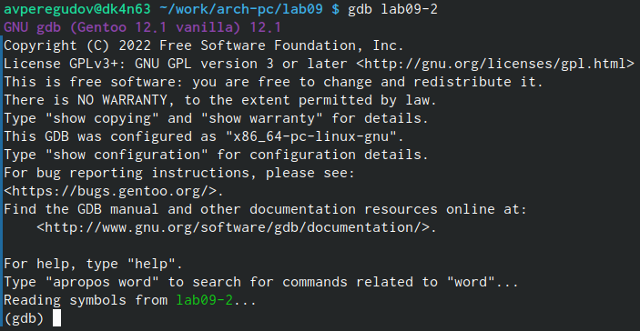{#fig:009 width=70%}

10. Проверил работу программы, запустив ее в оболочке GDB с помощью команды run (рис. @fig:010).

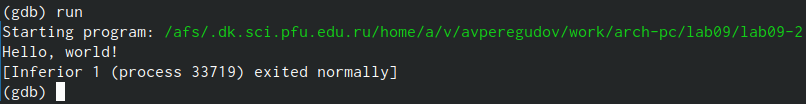{#fig:010 width=70%}

11. Установил точку останова на метку _start и запустил её. (рис. @fig:011).

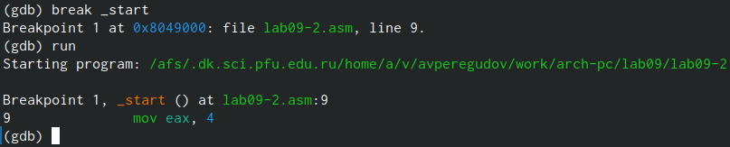{#fig:011 width=70%}

12. Посмотрел дисассимилированный код программы начиная с метки _start (рис. @fig:012).

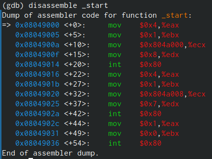{#fig:012 width=70%}

13. Переключился на отображение команд с Intel’овским синтаксисом (рис. @fig:013).

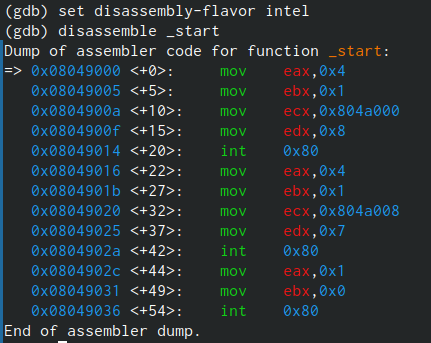{#fig:013 width=70%}

14. Включил режим псевдографики (рис. @fig:014).

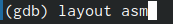{#fig:014 width=70%}

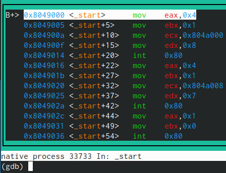{#fig:014 width=70%}

15. Включил режим псевдографики с отображением регистров (рис. @fig:015).

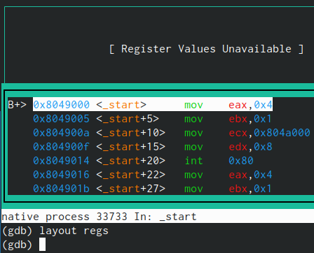{#fig:015 width=70%}

16. Проверил установленные точки останова с помощью команды info breakpoints (рис. @fig:017).

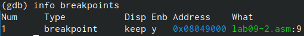{#fig:017 width=70%}

17. Установил еще одну точку останова по адресу инструкции и посмотрел информацию о всех установленных точках останова (рис. @fig:018).

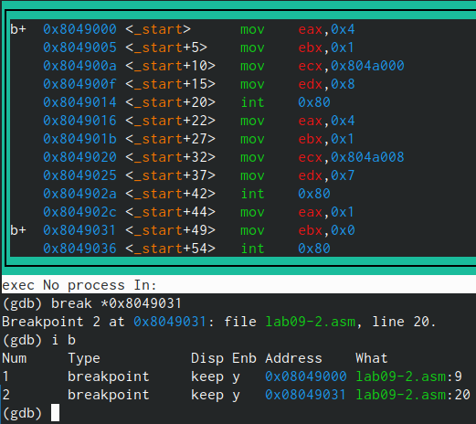{#fig:018 width=70%}

18. Выполнил 5 инструкций с помощью команды stepi (рис. @fig:019).

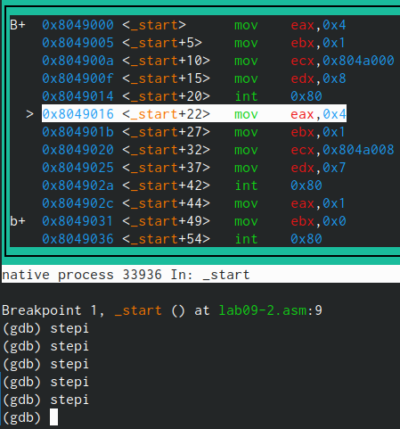{#fig:019 width=70%}

19. Посмотрел содержимое регистров (рис. @fig:020).

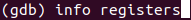{#fig:020 width=70%}

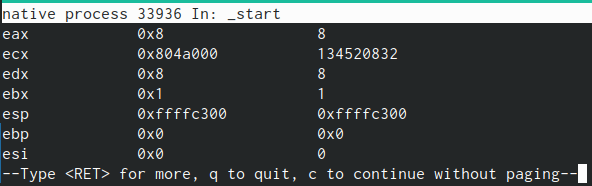{#fig:020 width=70%}

20. Посмотрел значение переменной msg1 по имени (рис. @fig:021).

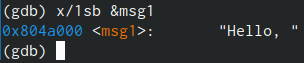{#fig:021 width=70%}

21. Посмотрел значение переменной msg2 по адресу (рис. @fig:022).

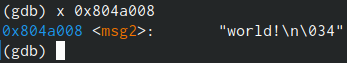{#fig:022 width=70%}

22. Посмотрел инструкцию mov ecx,msg2 которая записывает в регистр ecx адрес перемененной msg2 (рис. @fig:023).

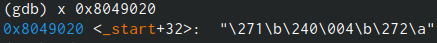{#fig:023 width=70%}

23. Изменил первый символ переменной msg1 (рис. @fig:024).

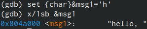{#fig:024 width=70%}

24. Изменил первый символ переменной msg2 (рис. @fig:025).

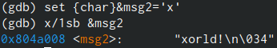{#fig:025 width=70%}

25. Вывел в различных форматах значение регистра edx (рис. @fig:026).

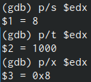{#fig:026 width=70%}

26. Изменил значение регистра ebx (рис. @fig:027).

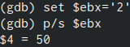{#fig:027 width=70%}

27. Завершил выполнение программы с помощью команды continue и вышел из GDB с помощью команды quit (рис. @fig:028).

{#fig:028 width=70%}

28. Скопировал файл lab8-2.asm, созданный при выполнении лабораторной работы №8 (рис. @fig:029).

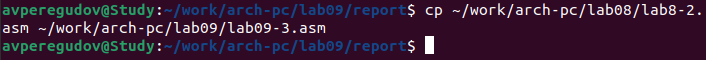{#fig:029 width=70%}

29. Создал исполняемый файл (рис. @fig:030).

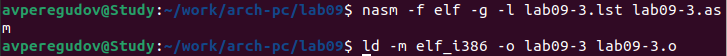{#fig:030 width=70%}

30. Загрузил исполняемый файл в отладчик, указав аргументы (рис. @fig:031).

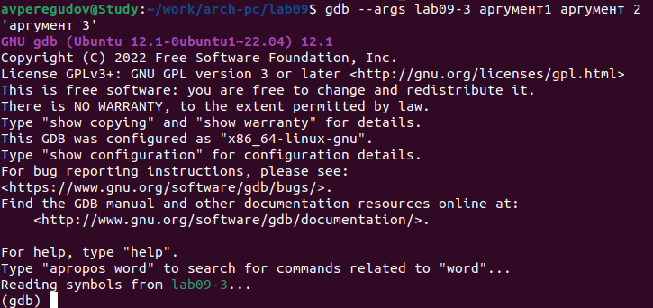{#fig:031 width=70%}

31. Установил точку останова перед первой инструкцией в программе и запустил
ее (рис. @fig:032).

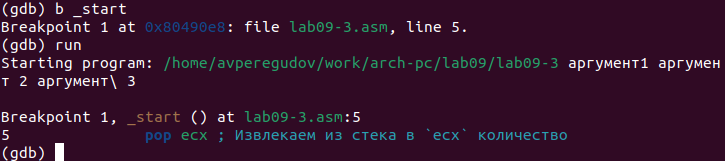{#fig:032 width=70%}

32. Посмотрел значение регистра esp (рис. @fig:033).

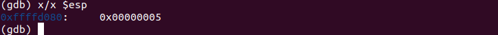{#fig:033 width=70%}

33. Посмотрел остальные позиции стека (рис. @fig:034).

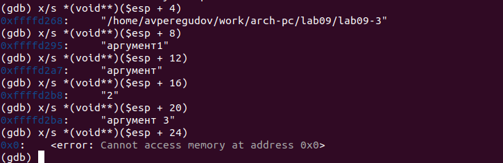{#fig:034 width=70%}

34. Скопировал программу из лабораторной работы № 8 (рис. @fig:035).

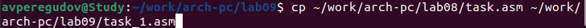{#fig:035 width=70%}

35. Переписал программу реализовав вычисление значения функции 𝑓(𝑥) как подпрограмму (рис. @fig:036).

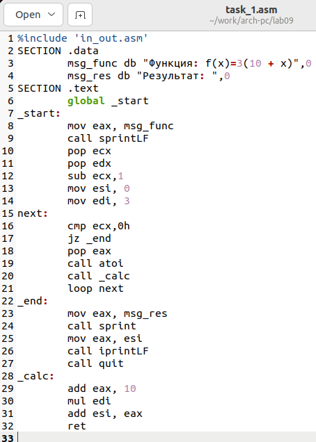{#fig:036 width=70%}

36. Создал исполняемый файл и проверил его работу с параметрами (рис. @fig:037).

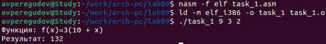{#fig:037 width=70%}

37. Создал файл task_2.asm (рис. @fig:038).

{#fig:038 width=70%}

38. Ввёл в файл task_2.asm текст программы из листинга 9.3 (рис. @fig:039).

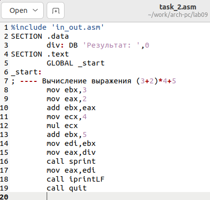{#fig:039 width=70%}

39. Создал исполняемый файл (рис. @fig:040).

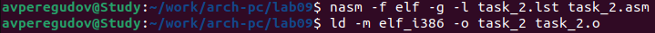{#fig:040 width=70%}

40. Запустил программу в оболочке GDB (рис. @fig:041).

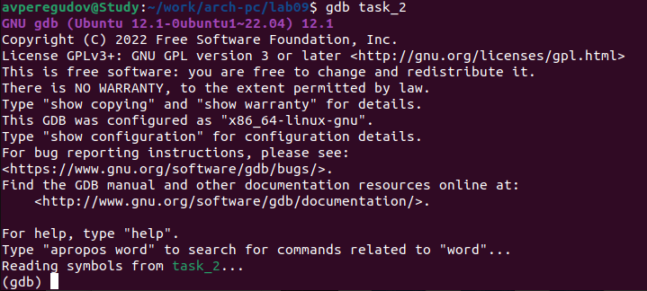{#fig:041 width=70%}

41. Установил точку останова на метку _start и переключился на отображение команд с Intel’овским синтаксисом (рис. @fig:042).

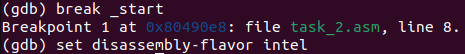{#fig:042 width=70%}

42. Включил режим псевдографики с отображением регистров (рис. @fig:043).

{#fig:043 width=70%}

43. Запустил программу в оболочке (рис. @fig:044).

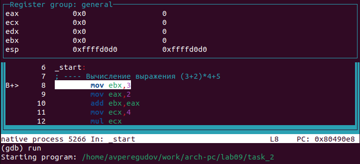{#fig:044 width=70%}

44. Ввёл 5 команд stepi и обнаружил что умножается не тот регистор (рис. @fig:045).

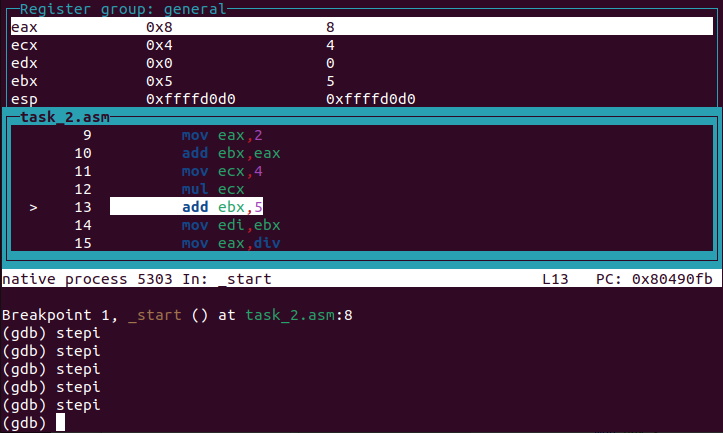{#fig:045 width=70%}

45. Изменил текст программы, приведя её в рабочее состояние (рис. @fig:046).

{#fig:046 width=70%}

46. Создал исполняемый файл и проверил его работу (рис. @fig:047).

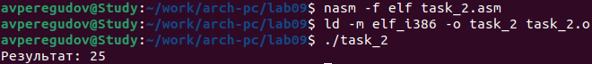{#fig:047 width=70%}

# Выводы

В этой лабораторной работе были приобретены навыки ннаписания программ с использованием подпрограмм, а также были рассмотренны методы отладки при помощи GDB и его основные возможности.

# Список литературы{.unnumbered}

::: {#refs}
:::
